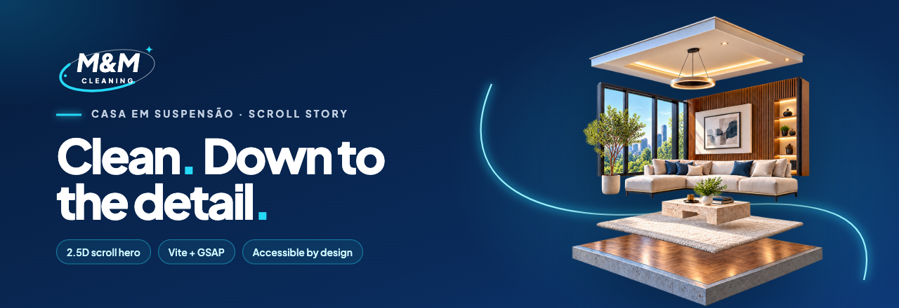
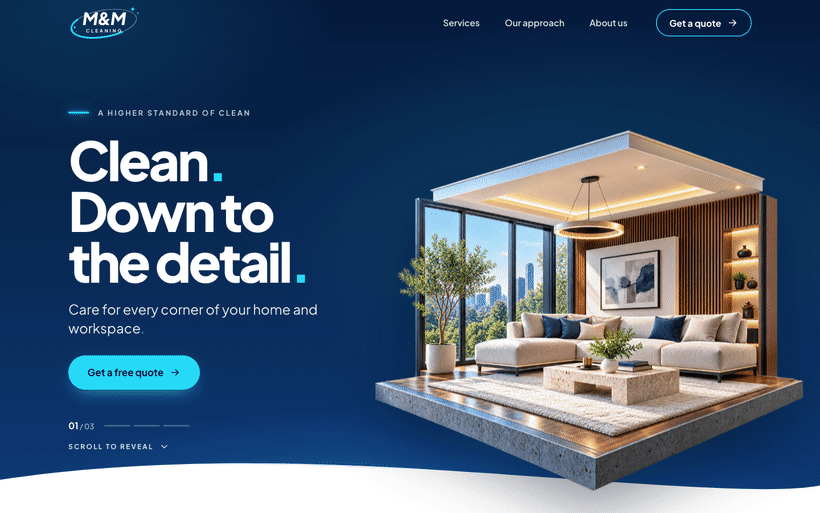
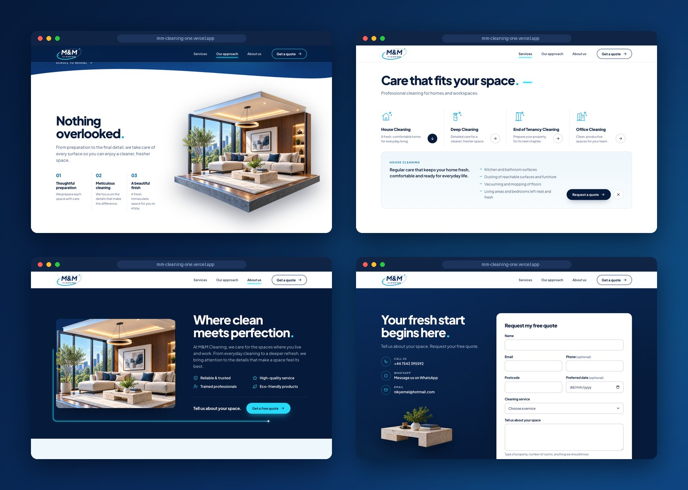
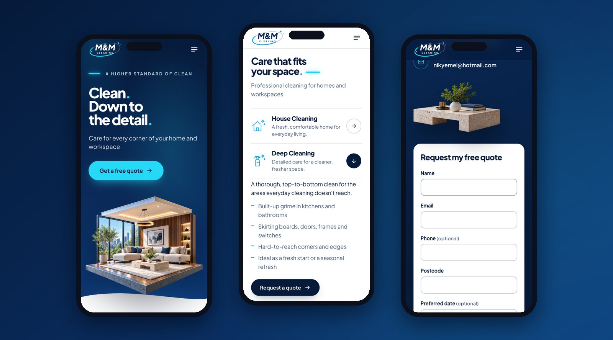

<div align="center">



<h3>A one-page website for a UK cleaning company, built around a scroll-driven 2.5D "house in suspension".</h3>

<p>
  <a href="https://mm-cleaning-one.vercel.app"><strong>🌐 Live site</strong></a>
  &nbsp;·&nbsp;
  <a href="#hero-animation"><strong>🎬 How the hero works</strong></a>
  &nbsp;·&nbsp;
  <a href="#getting-started"><strong>🛠️ Run it locally</strong></a>
</p>

<p>
  <a href="https://mm-cleaning-one.vercel.app"></a>
  
  
  
  
</p>

</div>

<br />

## 🚀 Overview

**M&M Cleaning** cares for the spaces where people live and work. This site turns that promise into a single idea: as you scroll, a spotless living room **lifts apart layer by layer**. Ceiling, walls, sofa, table, rug and floor each get their moment. A glowing cyan trail traces the details before everything settles back into place. Nothing is overlooked.

The rest of the page keeps that visual thread (the cyan trail shows up again as accents, dividers and focus states) and walks visitors from the first impression to a **free quote** request in a few scrolls.

- **Cinematic first impression**: a pinned 2.5D hero made of six real image layers, not a video
- **Clear path to contact**: every section leads to the quote form, which opens WhatsApp or email with the request already written
- **Built for every visitor**: static fallbacks on mobile and with reduced motion, full keyboard support, visible focus and semantic markup
- **Light**: about 1 MB of images for the whole experience, and the animated layers only load on desktop

<br />

<a name="hero-animation"></a>

## 🎬 The hero animation

<div align="center">
  <a href="https://mm-cleaning-one.vercel.app"></a>
  <sub>Scroll-scrubbed on the live site · captured at 1440 × 900</sub>
</div>

<br />

The hero stays pinned for 2.6 screen heights and follows a written scroll script:

| Scroll  | What happens                                                                                    |
| :------ | :---------------------------------------------------------------------------------------------- |
| 0–15%   | The assembled room, headline and **Get a free quote** call to action                            |
| 15–25%  | Short crossfade from the finished render to the six layers; the ceiling starts to rise          |
| 25–55%  | Walls and furniture drift apart; rug and floor reveal the separation; the camera pulls back      |
| 55–70%  | Suspended state: the cyan trail runs through **Surfaces → Corners → Finishing touches**          |
| 70–90%  | Layers return with overlapping timing                                                           |
| 90–100% | Back to the finished render, then the room glides into the next section as navy turns to white |

**Under the hood**

- 🧩 **Six transparent PNG layers** stacked on a square stage with `transform-origin: top left`, offsets expressed as fractions of the stage, so the scene scales to any screen.
- 📐 **Measured, not guessed.** The layers were generated separately, so each one was positioned by **image registration** against the assembled render (masked template matching across a range of scales). The rug, mostly hidden behind furniture, was placed by hand.
- 🔁 **Seamless handoff.** A second scroll trigger moves the room from the hero into its slot in *Nothing overlooked.*. It stays still on screen while the page moves around it, then the section's own image takes over in exactly the same spot.
- 🐢 **Graceful by default.** Below 1024 px, on short screens and with `prefers-reduced-motion`, the hero shows the finished room as a still image and the layers are never downloaded.

<br />

## 🖥️ Sections

<div align="center">
  
</div>

<br />

| #   | Section                  | Anchor      | Role                                                                                       |
| :-- | :----------------------- | :---------- | :----------------------------------------------------------------------------------------- |
| 01  | **Clean. Down to the detail.** | `#hero`     | First impression and first call to action                                            |
| 02  | **Nothing overlooked.**  | `#approach` | Three steps: thoughtful preparation, meticulous cleaning, a beautiful finish               |
| 03  | **Care that fits your space.** | `#services` | House, deep, end of tenancy and office cleaning; each opens a panel with **Request a quote** |
| 04  | **Where clean meets perfection.** | `#about` | The people behind the care, plus the company's qualities                              |
| 05  | **See the difference.**  | `#results`  | Before/after comparator, built and hidden until real, authorised photos exist             |
| 06  | **A few things you might like to know.** | `#faq` | One-at-a-time accordion                                                         |
| 07  | **Your fresh start begins here.** | `#quote` | Validated form plus direct phone, WhatsApp and email                                |
| 08  | Footer                   | n/a         | The cyan trail ends at the logo, closing the thread that starts in the hero                |

<br />

## 📱 Mobile first, motion optional

<div align="center">
  
</div>

<br />

- Hero with the text above the room and no long pinned scroll
- Services become an accordion; FAQ and form stack in a single column
- Every touch target is at least 44 px; no horizontal scroll at 390 px
- Nothing depends on hover

<br />

## ✨ Highlights

- **🎞️ Scroll storytelling**: GSAP ScrollTrigger timeline mapped one to one to the scroll script
- **💬 Quote form with no backend**: validation next to each field, focus moves to the first error, and the request opens in **WhatsApp** (or email) ready to send. No fake "message sent" screen.
- **🎯 Smart deep links**: *Request a quote* inside a service panel scrolls to the form with that service already selected
- **🧭 Adaptive header**: white logo on navy, blue logo on light sections, active link follows the reader
- **♿ Accessible components**: ARIA accordion for services, native exclusive `<details>` for the FAQ, skip link, labelled fields and live status messages
- **🖼️ Image pipeline**: original PNGs kept as sources, WebP derivatives generated with `npm run images`
- **🔎 Ready to share**: Open Graph image, structured data (`LocalBusiness`), canonical URL and favicons

<br />

## 💻 Tech stack

| <br />Vite 6 | <br />GSAP 3 | <br />JavaScript | <br />HTML5 | <br />CSS3 | <br />Vercel |
| :---: | :---: | :---: | :---: | :---: | :---: |

### Why this stack?

- **Vite + plain JavaScript**: a one-page marketing site doesn't need a framework runtime; the page is static HTML with small, focused modules
- **GSAP ScrollTrigger**: pinning, scrubbing and refresh handling that stay solid across screen sizes
- **Self-hosted Plus Jakarta Sans**: bold, clean display type without third-party font requests
- **Vercel**: every push to `main` deploys automatically

<br />

## 🎨 Design system

| Token          | Value                                                                                 | Use                                      |
| :------------- | :------------------------------------------------------------------------------------ | :--------------------------------------- |
| Navy           |           | Hero, about, quote, footer               |
| Support blue   |           | Gradients, blue logo                     |
| Cyan           |           | Trail, accents, primary button on navy   |
| White          |           | Approach, services                       |
| Ice            |           | FAQ, panels                              |

- **Type**: Plus Jakarta Sans; headings 48–64 px on desktop and 30–36 px on mobile, body 16–18 px
- **Grid**: 1,200 px content width, 12 columns, 64 px margins (24 px on mobile)
- **Rhythm**: 96–120 px between sections on desktop, 56–72 px on mobile
- **Motion**: entrances of 16–24 px over 350–550 ms; titles and forms stay still

<br />

<a name="getting-started"></a>

## 🛠️ Getting started

```bash
# Clone the repository
git clone https://github.com/Jeanfr1/m-mwebsite.git
cd m-mwebsite

# Install dependencies (Node 20.9+)
npm install

# Start the dev server  →  http://localhost:5173
npm run dev

# Production build  →  dist/
npm run build

# Preview the production build
npm run preview

# Regenerate the WebP images from the PNG sources
npm run images
```

<br />

## 📁 Project structure

```
m-mwebsite/
├── index.html                  # Every section: hero → approach → services → about → results → faq → quote → footer
├── src/
│   ├── main.js                 # Entry: fonts, styles, module init
│   ├── styles/main.css         # Design tokens, grid, components, responsive rules
│   ├── js/
│   │   ├── hero.js             # Layer calibration, scroll timeline, handoff into #approach
│   │   ├── header.js           # Mobile menu, theme switching, active link
│   │   ├── services.js         # Service panels / accordion, quote preselection
│   │   ├── quote-form.js       # Validation + WhatsApp / email handoff
│   │   ├── reveal.js           # Entrance animations and cyan traces
│   │   ├── faq.js              # Exclusive accordion fallback
│   │   └── compare.js          # Before/after slider (touch, mouse, keyboard)
│   └── assets/room/            # Optimised WebP (generated)
├── design/
│   ├── mockup-aprovado.png     # Approved visual direction
│   └── source/                 # Original PNG layers, manifest and production brief
├── public/                     # Favicon, Open Graph image, robots.txt
└── scripts/optimize-images.mjs # PNG → WebP pipeline (sharp)
```

<br />

## 🚀 Deployment

Hosted on **Vercel** and connected to this repository: every push to `main` ships to production.

**Live site:** [mm-cleaning-one.vercel.app](https://mm-cleaning-one.vercel.app)

| Setting          | Value           |
| :--------------- | :-------------- |
| Framework        | Vite            |
| Build command    | `npm run build` |
| Output directory | `dist`          |

<br />

## 📌 Content checklist

Items waiting on the client. Each one is marked `TODO(M&M)` in `index.html`.

- [ ] Real team photo for **About** (a crop of the room render is standing in)
- [ ] Official logo files (the current logo is an SVG recreated from the mockup)
- [ ] Confirm the scope of each service panel
- [ ] Confirm the wording of the four company qualities
- [ ] Answers for: areas covered, cleaning products, what each service includes, regular cleans
- [ ] Authorised before/after photos to switch on **See the difference** (renders are never shown as results)
- [ ] Areas served, privacy policy and terms for the footer
- [ ] Custom domain (then update `canonical` and `og:url`)

<br />

## 🙏 Acknowledgments

- **M&M Cleaning** for the brief and the approved visual direction
- **[GSAP](https://gsap.com)** for the scroll engine
- **[Lucide](https://lucide.dev)** for the line icons the interface icons are based on (ISC)
- **[Plus Jakarta Sans](https://fonts.google.com/specimen/Plus+Jakarta+Sans)** by Tokotype (OFL)
- **[Vite](https://vite.dev)** and **[Vercel](https://vercel.com)**

<br />

---

<div align="center">
  
  <p><strong>Where Clean Meets Perfection</strong></p>
  <p>Built with ❤️ by <a href="https://github.com/Jeanfr1">Jean</a> for M&amp;M Cleaning</p>
  <sub>© 2026 M&amp;M Cleaning. All rights reserved.</sub>
</div>
